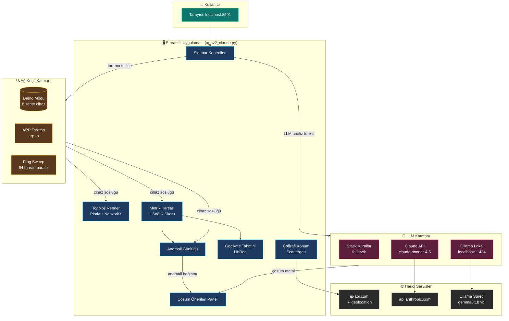
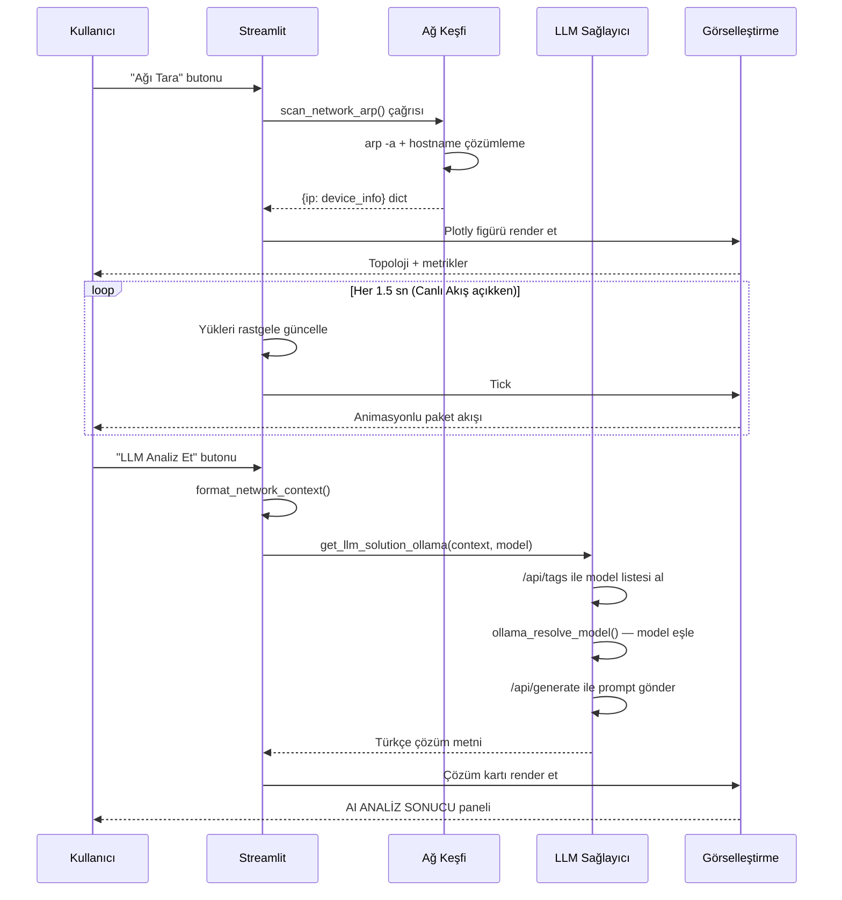

# NetViz Pro — Network Intelligence Platform

  

> Streamlit tabanlı, gerçek zamanlı ağ izleme ve LLM destekli anomali analiz arayüzü.

  

---

  

## İçindekiler

  

1. [Bu Sistem Ne İşe Yarar?](#1-bu-sistem-ne-işe-yarar)

2. [Özellikler](#2-özellikler)

3. [Sistem Mimarisi (Mermaid)](#3-sistem-mimarisi-mermaid)

4. [Kurulum](#4-kurulum)

5. [Çalıştırma](#5-çalıştırma)

6. [Nasıl Kullanılır? (Adım Adım)](#6-nasıl-kullanılır-adım-adım)

7. [Örnek Girdi → Çıktı Senaryoları](#7-örnek-girdi--çıktı-senaryoları)

8. [LLM Sağlayıcı Karşılaştırması](#8-llm-sağlayıcı-karşılaştırması)

9. [Dosya Yapısı](#9-dosya-yapısı)

10. [Sık Karşılaşılan Hatalar](#10-sık-karşılaşılan-hatalar)

11. [Lisans ve Kaynaklar](#11-lisans-ve-kaynaklar)

  

---

  

## 1. Bu Sistem Ne İşe Yarar?

  

NetViz Pro, bir ağ yöneticisinin günlük olarak yapması gereken üç temel işi tek bir ekranda toplayan görsel bir analiz aracıdır:

  

**Birincisi**, ağdaki cihazları otomatik keşfeder. ARP tablosundan veya ping taraması yaparak yerel ağdaki canlı IP'leri bulur, hostname'leri çözer ve bunları interaktif bir topoloji grafiğine yerleştirir. Sunum/test ortamları için 8 simüle cihaz içeren bir **Demo Modu** da vardır.

  

**İkincisi**, her cihazın yükünü ve gecikmesini gerçek zamanlı izler. Yük belirli bir eşiği aştığında cihazı kırmızıya boyar, anomali günlüğüne kayıt düşer ve linear regression ile gelecek 10 dakikanın gecikme tahminini çizer.

  

**Üçüncüsü**, anomali tespit edilen cihazlar için **LLM destekli çözüm önerileri** üretir. Üç kaynak desteklenir:

  

-  **Yok (Statik)** — kural tabanlı sabit öneriler (router/server/switch için klasik öneriler)

-  **Claude API** — Anthropic'in `claude-sonnet-4-5` modeli, internet gerektirir

-  **Ollama (Lokal)** — kullanıcının makinesinde çalışan açık kaynak modeller (gemma3:1b, llama3.2 vb.), tamamen offline

  

Bunlara ek olarak, gateway'in dış IP'si üzerinden ağın coğrafi konumu çıkarılır ve dünya haritasında gösterilir; istenen herhangi bir IP de aynı şekilde sorgulanabilir.

  

**Hedef kullanıcı:** Veri görselleştirme dersi öğrencileri, küçük ofis ağ yöneticileri, eğitim/sunum amaçlı ağ topolojisi göstermek isteyenler.

  

---

  

## 2. Özellikler

  

| Modül | Açıklama |

|---|---|

| 🌐 Topoloji Görünümü | Plotly + NetworkX ile force-directed ağ grafiği, animasyonlu paket akışı |

| 🔥 Isı Haritası | Cihaz yüküne göre renklendirme |

| 🔍 Yol İzleme | Tek cihaz odaklı bağlantı analizi |

| 📡 Ağ Keşfi | ARP (`arp -a`) veya çok iş parçacıklı ping sweep |

| 🤖 LLM Analizi | Claude API veya Ollama (lokal) ile akıllı çözüm önerileri |

| 📈 Tahmin Modülü | Lineer regresyon ile 10 dakikalık gecikme öngörüsü |

| 🌍 Coğrafi Konum | ip-api.com ile dış IP → şehir/ülke/ISP eşlemesi |

| 📥 CSV Raporu | Cihaz durumlarını zaman damgalı CSV olarak indir |

| 💚 Sağlık Skoru | 0-100 arası kompozit ağ sağlık göstergesi |

  

---

  

## 3. Sistem Mimarisi (Mermaid)

  

Aşağıdaki diyagram NetViz Pro'nun veri akışını ve bileşenler arası ilişkiyi gösterir. GitHub, GitLab ve modern Markdown editörleri bu kodu otomatik olarak diyagrama çevirir.

  



  

### Veri Akışı (Sıralama)

  



  

---

  

## 4. Kurulum

  

### Ön Koşullar

  

-  **Python 3.10+** (önerilen: 3.13)

-  **Ollama** (lokal LLM kullanmak istiyorsanız) — https://ollama.com/download

-  **Anthropic API anahtarı** (Claude API kullanmak istiyorsanız)

-  **Yönetici/sudo yetkisi** (ARP taraması için, Windows'ta admin CMD)

  

### Bağımlılıklar

  

`requirements.txt` içeriği:

  

```

streamlit

plotly

networkx

requests

anthropic

pandas

```

  

### Adım 1 — Sanal Ortam Oluştur

  

**Windows:**

```powershell

python -m venv .venv

.venv\Scripts\activate

pip install -r requirements.txt

```

  

**Linux / macOS:**

```bash

python3  -m  venv  .venv

source  .venv/bin/activate

pip  install  -r  requirements.txt

```

  

### Adım 2 — Ollama Kurulumu (Opsiyonel ama Önerilir)

  

```powershell

# Ollama'yı indir ve kur (https://ollama.com/download)

# Kurulumdan sonra hızlı bir model çek:

ollama pull gemma3:1b

ollama list

```

  

`ollama list` çıktısında `gemma3:1b` görünmeli:

  

```

NAME ID SIZE MODIFIED

gemma3:1b abc123def 815 MB 2 minutes ago

```

  

---

  

## 5. Çalıştırma

  

### Yöntem 1 — Doğrudan Streamlit ile

  

```powershell

streamlit run appv2_claude.py

```

  

Tarayıcı otomatik açılır: `http://localhost:8501`

  

### Yöntem 2 — BASLAT.bat (Windows kolaylaştırıcı)

  

`BASLAT.bat` dosyasına çift tıklayın. İlk çalıştırmada `kurulum.bat` tetiklenir, sanal ortam ve paketler otomatik kurulur. Sonraki çalıştırmalarda direkt uygulama açılır.

  

---

  

## 6. Nasıl Kullanılır? (Adım Adım)

  

### A. Demo Modunda Hızlı Tur

  

1. Uygulamayı başlatın

2. Sidebar'da **DEMO MODU** açık olmalı (varsayılan)

3.  **CANLI AKIŞ** açıkken topolojide paketlerin akışını izleyin

4.  **KRİTİK EŞİK** kaydırıcısını oynatın — eşiğin üstündeki cihazlar kırmızıya döner

5. Sağda **Anomali Günlüğü** ve **Çözüm Önerileri** otomatik güncellenir

  

### B. Gerçek Ağ Taraması

  

1. Sidebar'da **DEMO MODU**'nu kapatın

2.  **Tarama Yöntemi** seçin:

-  **ARP (Hızlı)** → 1-2 saniyede ARP cache'inden cihazları okur

-  **Ping Sweep** → 5-15 saniyede `/24` subnet'i tarar

3.  **🔄 AĞI TARA** butonuna basın

4. Topoloji ve cihaz listesi gerçek IP'lerle dolar

  

### C. LLM Analizi

  

1. Sidebar'da **LLM Sağlayıcı** açılır menüsünden seçim yapın:

-  **Yok (Statik)** → kural tabanlı sabit öneriler (LLM gerekmez)

-  **Claude API** → API key girin (formatı: `sk-ant-...`)

-  **Ollama (Lokal)** → otomatik kurulu modelleri listeler, birini seçin

2.  **🤖 LLM ANALİZ ET** butonuna basın

3. Sağdaki **🤖 ÇÖZÜM ÖNERİLERİ** panelinde Türkçe analiz görünür

  

### D. CSV Raporu İndir

  

Sidebar'ın altındaki **📥 RAPOR İNDİR (CSV)** butonu tüm cihazların anlık durumunu zaman damgalı bir CSV olarak indirir.

  

---

  

## 7. Örnek Girdi → Çıktı Senaryoları

  

### Senaryo 1: Yüksek Yüklü Web Sunucusu Tespiti

  

**Girdi (Demo Modu, Eşik %80):**

  

```

App-SRV-02 (10.2.1.2)

Tür: server

Yük: %93

Gecikme: ~52ms

Durum: KRİTİK

```

  

**Statik Çıktı (LLM Yok):**

  

```

⚡ App-SRV-02 — ÇÖZÜM

Sorun: CPU/Bellek yükü kritik (%93)

Öneri: Yük dengeleme veya yatay ölçeklendirme önerilir.

Komut: # nginx upstream

upstream backend {

server 10.2.1.2;

}

```

  

**Ollama Çıktı (gemma3:1b):**

  

```

[Model: gemma3:1b]

  

App-SRV-02 (10.2.1.2) yüksek CPU/bellek kullanımı sorununu

yaşıyor. Olası nedenler:

1. Tek noktada toplanan istek trafiği

2. Bellek sızıntısı yapan bir uygulama süreci

3. Yetersiz CPU çekirdeği

  

Önerilen müdahale:

- Önce 'top' komutu ile yoğun süreci tespit edin

- Yatay ölçeklendirme için ikinci bir App sunucusu ekleyip

load balancer'ın arkasına alın

- Geçici çözüm olarak servisi yeniden başlatın

  

Komut:

ssh admin@10.2.1.2 'top -bn1 | head -20'

systemctl restart appserver

```

  

### Senaryo 2: Gerçek Ağ Taraması (ARP)

  

**Girdi:** Demo Modu kapalı, ARP taraması tetiklendi

  

**Çıktı:**

  

```

📡 5 gerçek cihaz aktif

  

192.168.1.1 - router - %22 - AA:BB:CC:11:22:33

192.168.1.5 - server - %18 - AA:BB:CC:11:22:44

192.168.1.10 - host - %35 - AA:BB:CC:11:22:55

192.168.1.42 - host - %12 - AA:BB:CC:11:22:66

192.168.1.105 - host - %44 - AA:BB:CC:11:22:77

```

  

### Senaryo 3: IP Konum Sorgulama

  

**Girdi:**  `8.8.8.8`

  

**Çıktı:**

  

```

📍 8.8.8.8

🌍 Ülke: United States

🏙 Şehir: Mountain View

🏢 ISP: Google LLC

📡 Koordinat: 37.4056, -122.0775

```

  

Ardından dünya haritasında kırmızı bir nokta olarak işaretlenir.

  

### Senaryo 4: Sağlık Skoru Hesabı

  

```

8 cihaz, eşik %80

- 6 cihaz NORMAL (%30 altı) → 100 puan x 6 = 600

- 1 cihaz UYARI (%50-%80 arası) → 60 puan x 1 = 60

- 1 cihaz KRİTİK (%80 üstü) → 15 puan x 1 = 15

  

Toplam: 675 / 8 = 84 → AĞ SAĞLIK SKORU: 84/100 (✓ sağlıklı)

```

  

---

  

## 8. LLM Sağlayıcı Karşılaştırması

  

| Özellik | Yok (Statik) | Claude API | Ollama (Lokal) |

|---|---|---|---|

| İnternet gerektirir | Hayır | Evet | Hayır |

| Maliyet | Ücretsiz | Token başı ücretli | Ücretsiz |

| Yanıt kalitesi | Düşük (sabit) | Çok yüksek | Orta-yüksek |

| Yanıt hızı | Anlık | 2-5 sn | 10-60 sn (model boyutuna göre) |

| Veri gizliliği | Tam | Anthropic'e gider | Tam (lokal) |

| Kurulum zorluğu | Yok | API key gerekli | Ollama + model indirme |

| Sunum güvenliği | En sağlam | İnternet kesilirse riskli | İnternet bağımsız |

  

**Öneri:** Eğitim/sunum için **Ollama + gemma3:1b** kombinasyonu en güvenli olanıdır. Üretim ortamı için **Claude API** daha akıllı sonuçlar verir.

  

---

  

## 9. Dosya Yapısı

  

```

proje-klasoru/

├── appv2_claude.py ← Ana Streamlit uygulaması

├── requirements.txt ← Python bağımlılıkları

├── BASLAT.bat ← Windows başlatıcı

├── kurulum.bat ← İlk kurulum scripti

├── README.md ← Bu dosya

└── .venv/ ← Sanal ortam (otomatik oluşur)

```

  

---

  

## 10. Sık Karşılaşılan Hatalar

  

### "Ollama'ya bağlanılamıyor (http://localhost:11434)"

  

Ollama servisi çalışmıyor demektir. Çözüm:

  

```powershell

# Yeni terminal açın

ollama serve

```

  

Bu pencereyi kapatmadan başka terminalde uygulamayı çalıştırın.

  

### "Hiç model kurulu değil"

  

Ollama açık ama model indirilmemiş:

  

```powershell

ollama pull gemma3:1b

```

  

### "'gemma3:1b' yanıt vermedi (180sn timeout)"

  

Model RAM'e sığmıyor veya makineniz çok yavaş. Daha küçük bir model deneyin:

  

```powershell

ollama pull tinyllama

```

  

### "Geçersiz Claude API Key"

  

API key formatı `sk-ant-...` ile başlamalıdır. https://console.anthropic.com adresinden yeni bir key oluşturun.

  

### ARP taraması cihaz bulamıyor

  

- Windows'ta CMD'yi **Yönetici olarak** açın

-  `arp -a` komutunu manuel çalıştırarak ARP cache'inde IP'lerin olup olmadığını kontrol edin

- ARP cache boşsa önce `Ping Sweep` yöntemini deneyin

  

### "Streamlit eski kodu çalıştırıyor"

  

Streamlit cache'i nedeniyle bazen yeni değişiklikler yansımaz. Çözüm:

  

1. Terminalde **Ctrl+C** ile durdurun

2. Tarayıcıda **Ctrl+Shift+R** ile hard refresh yapın

3.  `streamlit run appv2_claude.py` ile yeniden başlatın

  

---

  

## 11. Lisans ve Kaynaklar

  

### Kullanılan Açık Kaynak Kütüphaneler

  

- [Streamlit](https://streamlit.io/) — Web framework

- [Plotly](https://plotly.com/python/) — İnteraktif görselleştirme

- [NetworkX](https://networkx.org/) — Graf hesaplamaları

- [Ollama](https://ollama.com/) — Lokal LLM çalıştırma

- [Anthropic SDK](https://docs.anthropic.com/) — Claude API erişimi

  

### Harici API'ler

  

-  **ip-api.com** — Ücretsiz IP geolocation (saatte 45 sorgu sınırı)

-  **api.anthropic.com** — Claude LLM (kullanıcı API key'i ile)

  

### Notlar

  

Bu proje eğitim amaçlıdır. Üretim ortamında ARP taraması, ping sweep ve port enumeration gibi işlemler kurumsal güvenlik politikalarına aykırı olabilir; sadece kendi yetkilendirilmiş ağınızda kullanın.

  

---

  

**Sürüm:** 1.0

**Son güncelleme:** 2026

**Lisans:** Eğitim/araştırma kullanımı için serbest
